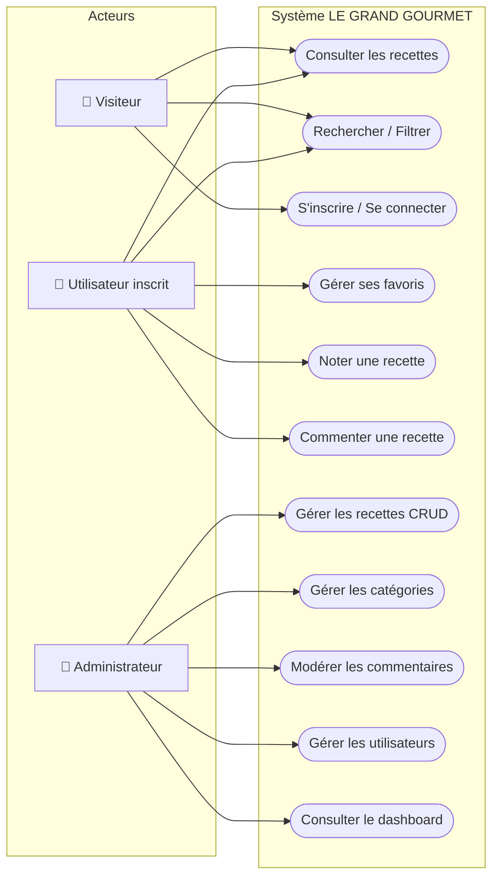
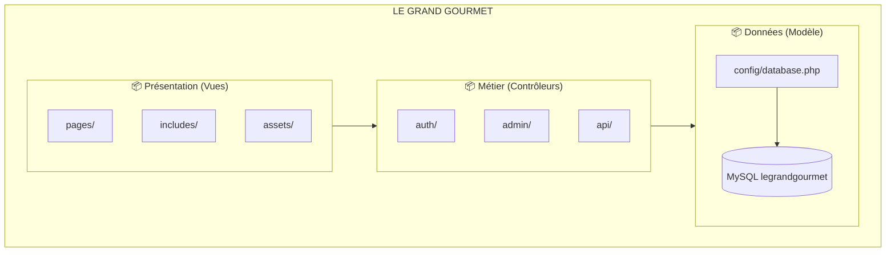
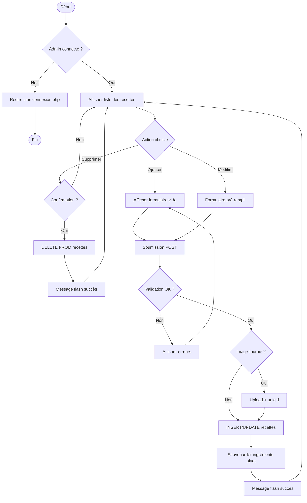
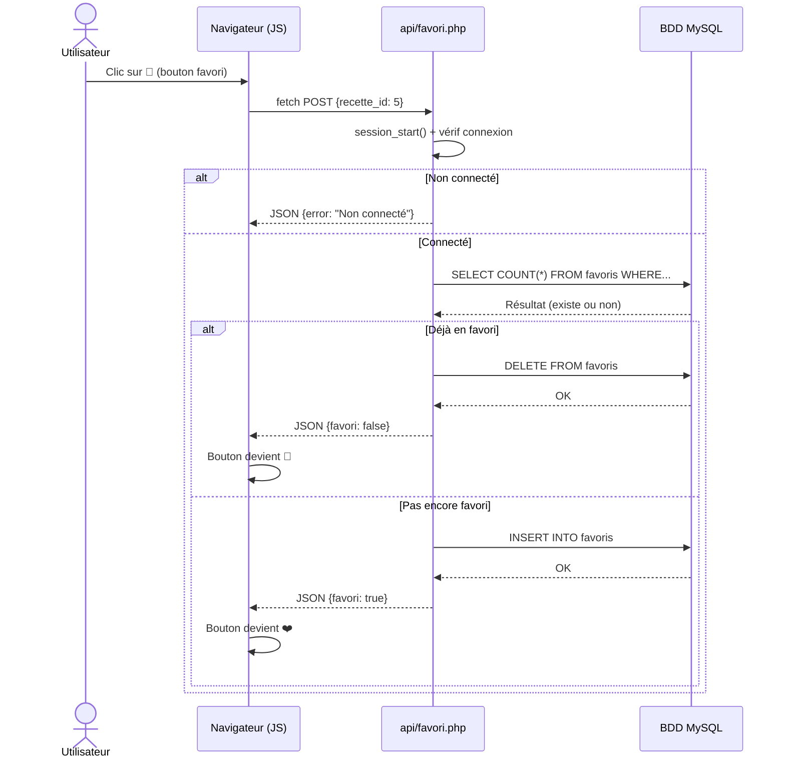
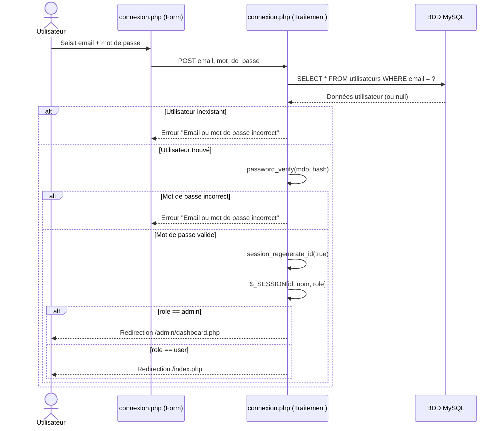

# Diagrammes UML — LE GRAND GOURMET

> 💡 Copie chaque bloc de code dans **https://mermaid.live** pour générer les images,
> puis exporte en PNG pour ton dossier de projet.

---

## 1. Diagramme de Use Cases



---

## 2. Diagramme de Packages



---

## 3. Diagramme d'activité — Mission 1 : CRUD Recette (Admin)



---

## 4. Diagramme de séquence — Mission 2 : Favori AJAX



---

## 5. Diagramme de séquence — Authentification



---

## 6. MLD (Modèle Logique de Données)

```
utilisateurs (id, nom, email, mot_de_passe, role, created_at)
    PK : id
    UNIQUE : email

categories (id, nom, slug, image)
    PK : id
    UNIQUE : slug

recettes (id, titre, description, temps_preparation, temps_cuisson,
          difficulte, portions, image, #categorie_id, created_at)
    PK : id
    FK : categorie_id → categories(id)

ingredients (id, nom, unite)
    PK : id

recettes_ingredients (#recette_id, #ingredient_id, quantite)
    PK : (recette_id, ingredient_id)
    FK : recette_id → recettes(id)
    FK : ingredient_id → ingredients(id)

commentaires (id, #utilisateur_id, #recette_id, contenu, created_at)
    PK : id
    FK : utilisateur_id → utilisateurs(id)
    FK : recette_id → recettes(id)

favoris (#utilisateur_id, #recette_id, created_at)
    PK : (utilisateur_id, recette_id)
    FK : utilisateur_id → utilisateurs(id)
    FK : recette_id → recettes(id)

notes (id, #utilisateur_id, #recette_id, valeur)
    PK : id
    UNIQUE : (utilisateur_id, recette_id)
    FK : utilisateur_id → utilisateurs(id)
    FK : recette_id → recettes(id)
    CHECK : valeur BETWEEN 1 AND 5
```

---

## 7. MPD (Modèle Physique de Données)

```mermaid
erDiagram
    UTILISATEURS {
        INT id PK "AUTO_INCREMENT"
        VARCHAR_100 nom "NOT NULL"
        VARCHAR_150 email "NOT NULL UNIQUE"
        VARCHAR_255 mot_de_passe "NOT NULL (bcrypt)"
        ENUM role "admin|user DEFAULT user"
        DATETIME created_at "DEFAULT CURRENT_TIMESTAMP"
    }
    CATEGORIES {
        INT id PK "AUTO_INCREMENT"
        VARCHAR_100 nom "NOT NULL"
        VARCHAR_100 slug "NOT NULL UNIQUE"
        VARCHAR_255 image "NULL"
    }
    RECETTES {
        INT id PK "AUTO_INCREMENT"
        VARCHAR_200 titre "NOT NULL"
        TEXT description "NULL"
        INT temps_preparation "NOT NULL (minutes)"
        INT temps_cuisson "NOT NULL (minutes)"
        ENUM difficulte "facile|moyen|difficile"
        INT portions "DEFAULT 4"
        VARCHAR_255 image "NULL"
        INT categorie_id FK "NOT NULL"
        DATETIME created_at "DEFAULT CURRENT_TIMESTAMP"
    }
    INGREDIENTS {
        INT id PK "AUTO_INCREMENT"
        VARCHAR_100 nom "NOT NULL"
        VARCHAR_50 unite "NULL (g, ml, piece...)"
    }
    RECETTES_INGREDIENTS {
        INT recette_id PK_FK "ON DELETE CASCADE"
        INT ingredient_id PK_FK "ON DELETE RESTRICT"
        FLOAT quantite "NOT NULL"
    }
    COMMENTAIRES {
        INT id PK "AUTO_INCREMENT"
        INT utilisateur_id FK "ON DELETE CASCADE"
        INT recette_id FK "ON DELETE CASCADE"
        TEXT contenu "NOT NULL"
        DATETIME created_at "DEFAULT CURRENT_TIMESTAMP"
    }
    FAVORIS {
        INT utilisateur_id PK_FK "ON DELETE CASCADE"
        INT recette_id PK_FK "ON DELETE CASCADE"
        DATETIME created_at "DEFAULT CURRENT_TIMESTAMP"
    }
    NOTES {
        INT id PK "AUTO_INCREMENT"
        INT utilisateur_id FK "UNIQUE avec recette_id"
        INT recette_id FK "UNIQUE avec utilisateur_id"
        TINYINT valeur "CHECK 1-5"
    }

    CATEGORIES ||--o{ RECETTES : "classe"
    RECETTES ||--o{ RECETTES_INGREDIENTS : "contient"
    INGREDIENTS ||--o{ RECETTES_INGREDIENTS : "compose"
    UTILISATEURS ||--o{ COMMENTAIRES : "ecrit"
    RECETTES ||--o{ COMMENTAIRES : "recoit"
    UTILISATEURS ||--o{ FAVORIS : "ajoute"
    RECETTES ||--o{ FAVORIS : "figure"
    UTILISATEURS ||--o{ NOTES : "attribue"
    RECETTES ||--o{ NOTES : "recoit"
```
